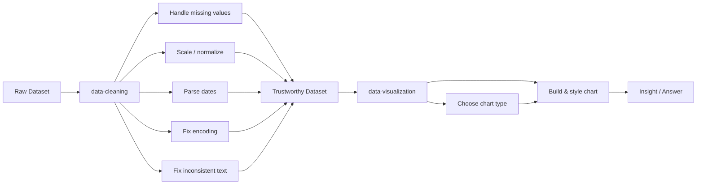

# data-viz-cleaning-toolkit

    

> Clean data doesn't guarantee a good chart. A good chart built on dirty data guarantees a wrong conclusion.

Eleven exercises across two connected skills: turning messy real-world data into something trustworthy, then turning that clean data into charts that actually communicate. Built on real datasets — museum visitor logs, earthquake records, Kickstarter campaigns, breast cancer diagnostics, and more.

## Repository Structure

```
data-viz-cleaning-toolkit/
│
├── data-cleaning/          5 exercises — missing values, scaling/normalization,
│                            parsing dates, character encodings, inconsistent entries
│
└── data-visualization/     6 exercises — line charts, bar charts, heatmaps,
                             scatter plots, distributions, styling, final project
```

## Pipeline

Every dataset in this repo moves through the same two-stage pipeline before it becomes a chart:



**Why this matters:** a chart built on unclean data tells a misleading story no matter how polished the visualization looks. Every dataset here reflects the kind of preprocessing covered in `data-cleaning/` before it's ever plotted.

## Courses Completed

| Course | Folder | Exercises | Certificate |
|---|---|---|---|
| [Data Cleaning](https://www.kaggle.com/learn/data-cleaning) | [`data-cleaning/`](./data-cleaning) | 5 | [🎓 Earned](./data-cleaning/certificate.png) |
| [Data Visualization](https://www.kaggle.com/learn/data-visualization) | [`data-visualization/`](./data-visualization) | 6 | [🎓 Earned](./data-visualization/certificate.png) |

## Tech Stack

| Layer | Tools |
|---|---|
| Language | Python |
| Data handling | pandas, numpy |
| Cleaning | scipy, fuzzywuzzy, charset_normalizer |
| Visualization | seaborn, matplotlib |
| Environment | Kaggle Notebooks |

## License

Licensed under the [MIT License](./LICENSE).
