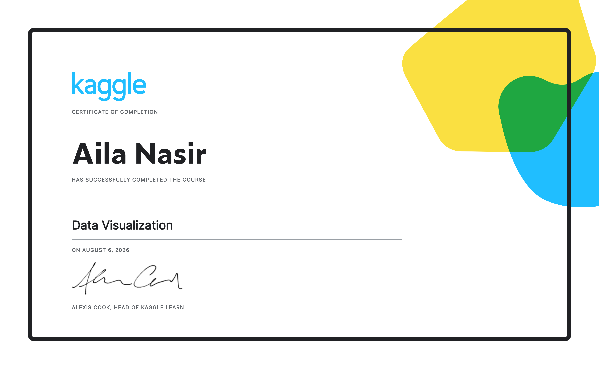

   

> The same two variables, plotted five different ways, answer five different questions.

Seven exercises. Six real datasets. From a single-line FIFA ranking chart to a self-selected final project built with zero starter code.

## Course Completed

| Course | Exercises | Certificate |
|---|---|---|
| [Data Visualization](https://www.kaggle.com/learn/data-visualization) | 6 | [🎓 Earned](./certificate.png) |

## Exercise Breakdown

| # | File | Dataset | Problem | Approach |
|---|---|---|---|---|
| 1 | [`ex1_hello_seaborn_line_charts.py`](./ex1_hello_seaborn_line_charts.py) | FIFA Rankings + LA Museum Visitors | Set up the plotting stack; track values over time | `sns.lineplot()` on a full DataFrame and on an isolated column to expose seasonal trends |
| 2 | [`ex2_bar_charts_heatmaps.py`](./ex2_bar_charts_heatmaps.py) | IGN Game Reviews | Compare one category cleanly; compare every combination at once | `sns.barplot()` per platform; `sns.heatmap(annot=True)` across the full genre × platform grid |
| 3 | [`ex3_scatter_plots.py`](./ex3_scatter_plots.py) | Candy Popularity Survey | Detect relationships between variables, with and without a third factor | `sns.scatterplot()`, `sns.regplot()`, `sns.lmplot(hue=...)`, `sns.swarmplot()` |
| 4 | [`ex4_distributions.py`](./ex4_distributions.py) | Breast Cancer Diagnostics | Compare how a feature is distributed across two diagnosis groups | `sns.histplot(hue=...)` and `sns.kdeplot(hue=..., shade=True)` |
| 5 | [`ex5_choosing_plot_types_custom_styles.py`](./ex5_choosing_plot_types_custom_styles.py) | Spotify Streaming Data | Presentation and readability, not just data accuracy | `sns.set_style()` across five built-in seaborn themes |
| 6 | [`ex6_final_project.py`](./ex6_final_project.py) | Data Science Job Salaries (self-selected) | End-to-end: choose, load, and visualize a dataset with no guided steps | `groupby()` + `sort_values()` to rank roles, then `sns.barplot()` |

---

### 1) Hello, Seaborn & Line Charts

```python
sns.lineplot(data=fifa_data)                       # every column, one call
sns.lineplot(data=museum_data['Avila Adobe'])       # isolate one trend
```
**Insight:** seaborn's defaults are strong enough that one line of code turns a raw CSV into a fully legended chart; isolating a single column exposes patterns a full-table view can hide.

### 2) Bar Charts and Heatmaps

```python
sns.barplot(x=ign_data.index, y=ign_data['Racing'])
sns.heatmap(data=ign_data, annot=True)
```
**Insight:** the highest-rated genre/platform combo in the dataset — PS4 Shooter at 9.25 — is invisible in a bar chart but obvious in a heatmap within seconds.

### 3) Scatter Plots

```python
sns.regplot(x=candy_data['sugarpercent'], y=candy_data['winpercent'])
sns.lmplot(x="pricepercent", y="winpercent", hue="chocolate", data=candy_data)
sns.swarmplot(x=candy_data['chocolate'], y=candy_data['winpercent'])
```
**Insight:** `lmplot` with `hue` fits a *separate* regression line per group instead of one line averaged across both — critical when a third variable changes the relationship.

### 4) Distributions

```python
sns.histplot(data=cancer_data, x='Area (mean)', hue='Diagnosis')
sns.kdeplot(data=cancer_data, x='Radius (worst)', hue='Diagnosis', shade=True)
```
**Insight:** comparing distributions, not just averages, is the same reasoning that sits behind real diagnostic classification tools.

### 5) Choosing Plot Types & Custom Styles

```python
sns.set_style("dark")   # or "darkgrid", "whitegrid", "white", "ticks"
sns.lineplot(data=spotify_data)
```
**Insight:** a technically correct chart can still fail to communicate if the styling fights the data — presentation is part of the analysis.

### 6) Final Project

```python
top_jobs = my_data.groupby('job_title')['salary_in_usd'].mean().sort_values(ascending=False).head(10)
sns.barplot(x=top_jobs.values, y=top_jobs.index)
```
**Insight:** the full pipeline end to end — picking a dataset, loading it, deciding what question it answers, choosing the matching chart — with no scaffolding provided.

## Tech Stack

`Python` · `pandas` · `seaborn` · `matplotlib` · `Kaggle Notebooks`

## Certificate


